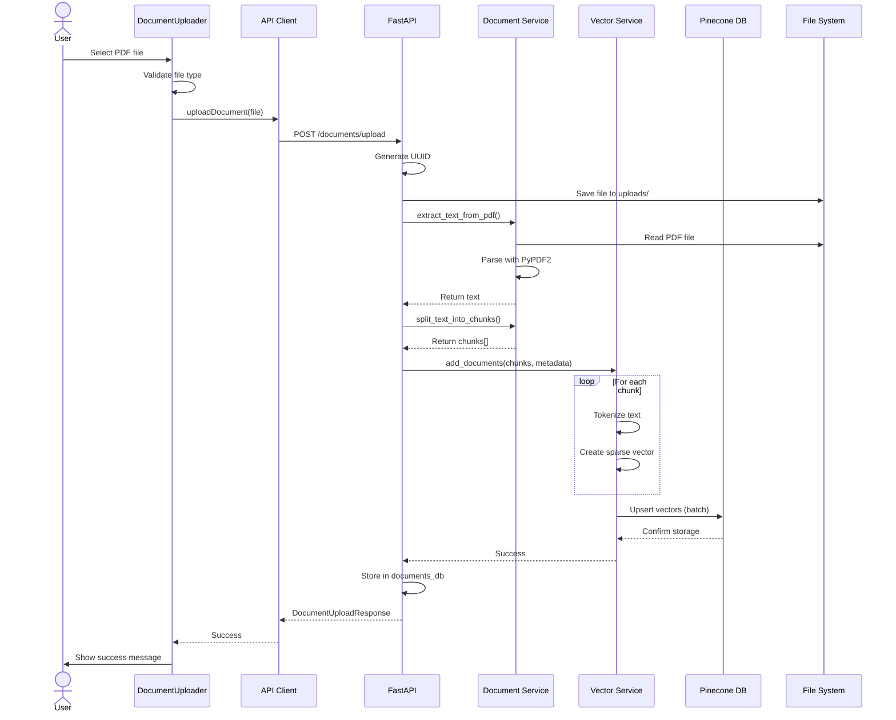
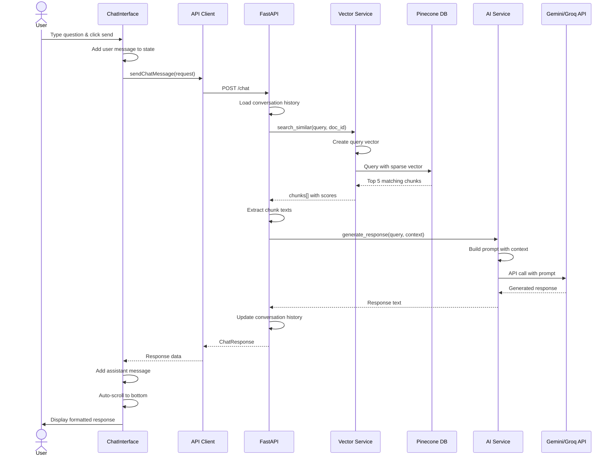
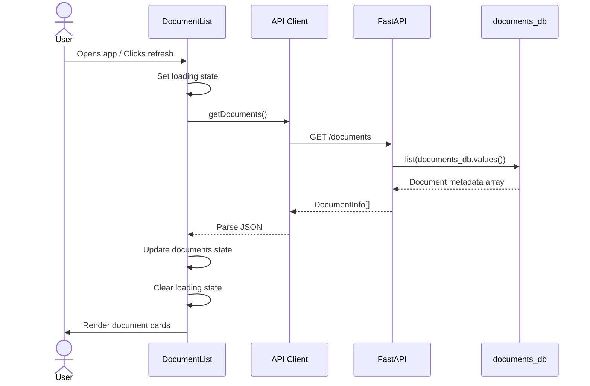
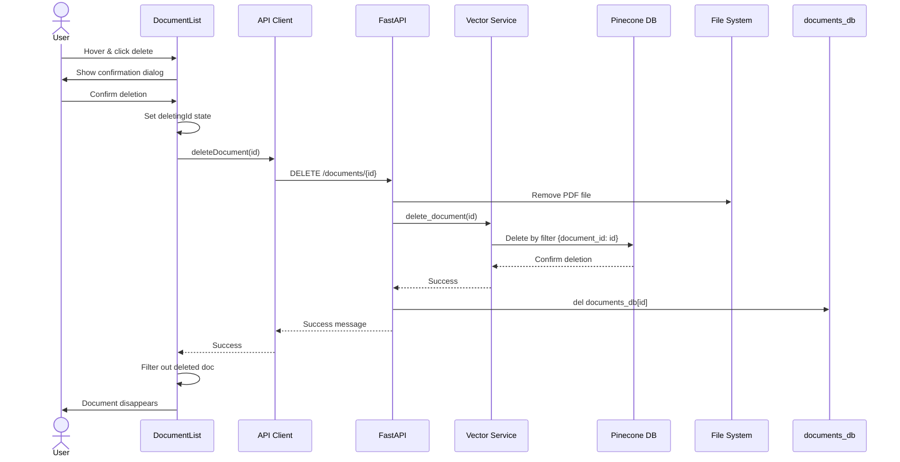

# 🏗️ RAG PDF Chatbot - Complete System Architecture

> **A comprehensive guide to understanding what's happening and how everything works in the backend and frontend**

---

## 📋 Table of Contents

1. [System Overview](#-system-overview)
2. [Backend Architecture](#-backend-architecture)
3. [Frontend Architecture](#-frontend-architecture)
4. [Complete Data Flows](#-complete-data-flows)
5. [Technology Stack](#-technology-stack)
6. [Data Stores & Schemas](#-data-stores--schemas)

---

## 🌐 System Overview

### Level 0 DFD: System Context

```mermaid
graph TB
    User([👤 User])
    System[🖥️ RAG PDF Chatbot System]
    AI[🤖 AI Provider<br/>Gemini/Groq]
    VectorDB[(🗄️ Vector Database<br/>Pinecone)]
    FileSystem[(💾 File System<br/>uploads/)]
    
    User -->|📄 Upload PDF| System
    User -->|💬 Chat Query| System
    User -->|📋 Manage Documents| System
    System -->|✨ AI Response| User
    System -->|✅ Document Status| User
    
    System -->|🎯 Generate Response| AI
    AI -->|📝 Text Response| System
    
    System -->|💾 Store Embeddings| VectorDB
    System -->|🔍 Search Vectors| VectorDB
    VectorDB -->|📊 Relevant Chunks| System
    
    System -->|💾 Save PDF| FileSystem
    System -->|📖 Read PDF| FileSystem
```



### What's Happening?

The RAG PDF Chatbot is a **Retrieval-Augmented Generation** system that allows users to:
- **Upload PDF documents** and have them processed automatically
- **Chat with documents** using natural language queries
- **Get AI-powered responses** based on the actual document content

**Key Concept**: Instead of the AI making up answers, it searches through your uploaded PDFs to find relevant information, then uses that as context to generate accurate, grounded responses.

---

## 🔧 Backend Architecture

### Level 1 DFD: Backend Components

```mermaid
graph LR
    subgraph Frontend
        UI[🎨 React UI]
    end
    
    subgraph Backend["⚙️ FastAPI Backend"]
        Main[🚀 main.py<br/>Entry Point]
        Config[⚙️ config.py<br/>Settings]
        
        subgraph Routes["📡 API Routes"]
            DocRoute[📄 documents.py]
            ChatRoute[💬 chat.py]
        end
        
        subgraph Services["🔨 Services"]
            DocSvc[📄 Document Service]
            VecSvc[🗄️ Vector Service]
            AISvc[🤖 AI Service]
        end
        
        Schemas[📦 schemas.py<br/>Data Models]
    end
    
    subgraph External["🌐 External Services"]
        Pinecone[(🗄️ Pinecone)]
        Gemini[🤖 Gemini/Groq]
        Storage[(💾 File System)]
    end
    
    UI -->|HTTP| Main
    Main --> Config
    Main --> DocRoute
    Main --> ChatRoute
    
    DocRoute --> DocSvc
    DocRoute --> VecSvc
    ChatRoute --> VecSvc
    ChatRoute --> AISvc
    
    DocRoute --> Schemas
    ChatRoute --> Schemas
    
    DocSvc --> Storage
    VecSvc --> Pinecone
    AISvc --> Gemini
```



### Backend Component Breakdown

#### 1. 🚀 **main.py** - Application Entry Point

**What it does:**
- Initializes the FastAPI application
- Loads environment variables from `.env` file
- Configures CORS to allow frontend access
- Registers API routes (documents, chat)
- Provides health check endpoints

**How it works:**
```python
# Pseudocode
app = FastAPI()
load_dotenv()  # Load API keys and settings
app.add_middleware(CORS)  # Allow frontend to connect
app.include_router(documents_router)  # Register /documents routes
app.include_router(chat_router)  # Register /chat routes
```

#### 2. ⚙️ **core/config.py** - Configuration Management

**What it does:**
- Centralizes all configuration settings
- Validates environment variables
- Provides cached access to settings

**Configuration includes:**
- ✅ AI Provider credentials (Gemini/Groq API keys)
- ✅ Vector Database settings (Pinecone API key, index name)
- ✅ File upload settings (directory, size limits)
- ✅ Text processing settings (chunk size, overlap)
- ✅ CORS origins for security

**How it works:**
```python
class Settings(BaseSettings):
    AI_PROVIDER: str = "gemini"
    GEMINI_API_KEY: str
    PINECONE_API_KEY: str
    CHUNK_SIZE: int = 1000
    CHUNK_OVERLAP: int = 200
```

#### 3. 📄 **api/routes/documents.py** - Document Management

**What it does:**
- Handles PDF upload requests
- Lists all uploaded documents
- Provides document details
- Deletes documents and their embeddings
- Searches through documents

**Endpoints:**

| Method | Endpoint | Purpose |
|--------|----------|---------|
| `POST` | `/upload` | Upload and process PDF |
| `GET` | `/` | List all documents |
| `GET` | `/{id}` | Get document details |
| `DELETE` | `/{id}` | Delete document |
| `POST` | `/search` | Search documents |

**How upload works:**
```
1. Receive PDF file from frontend
2. Validate file type (.pdf only)
3. Generate unique document ID (UUID)
4. Save file to uploads/ directory
5. Extract text from PDF
6. Split text into chunks
7. Create embeddings for each chunk
8. Store embeddings in Pinecone
9. Save document metadata
10. Return success response
```

#### 4. 💬 **api/routes/chat.py** - Chat Management

**What it does:**
- Receives chat queries from users
- Searches for relevant document chunks
- Generates AI responses with context
- Manages conversation history

**Endpoints:**

| Method | Endpoint | Purpose |
|--------|----------|---------|
| `POST` | `/` | Send chat message |
| `GET` | `/conversations/{id}` | Get conversation history |
| `DELETE` | `/conversations/{id}` | Delete conversation |

**How chat works:**
```
1. Receive user question + document ID
2. Load conversation history (if exists)
3. Create vector embedding from question
4. Search Pinecone for top 5 relevant chunks
5. Combine chunks as context
6. Build prompt: context + question + instructions
7. Send to AI (Gemini/Groq)
8. Receive AI-generated response
9. Update conversation history
10. Return response to user
```

#### 5. 📄 **services/document_service.py** - PDF Processing

**What it does:**
- Extracts text from PDF files
- Splits text into manageable chunks
- Handles document lifecycle

**Key Methods:**

**`extract_text_from_pdf(file_path)`**
```
Process:
1. Try pdfplumber first (better for complex PDFs)
2. Fallback to PyPDF2 if needed
3. Iterate through all pages
4. Extract text from each page
5. Combine into single text string
6. Return extracted text
```

**`split_text_into_chunks(text)`**
```
Process:
1. Split text by paragraphs (\n\n)
2. Start with empty current_chunk
3. For each paragraph:
   - If adding it exceeds chunk_size:
     * Save current_chunk
     * Keep last 50 words for overlap
     * Start new chunk with overlap + paragraph
   - Else:
     * Add paragraph to current_chunk
4. Filter out chunks with < 10 words
5. Return list of chunks
```

**Why chunking?**
- PDFs can be hundreds of pages long
- AI models have token limits
- Smaller chunks = more precise search results
- Overlap ensures context isn't lost at boundaries

#### 6. 🗄️ **services/vector_service.py** - Vector Operations

**What it does:**
- Converts text to sparse vector embeddings
- Stores embeddings in Pinecone
- Searches for similar text using vector similarity
- Manages vector lifecycle (add, search, delete)

**Key Concepts:**

**Sparse Vectors** (How text becomes searchable):
```
Text: "The quick brown fox jumps over the lazy dog"

Step 1: Tokenize
→ ["quick", "brown", "fox", "jumps", "over", "lazy", "dog"]

Step 2: Remove stop words
→ ["quick", "brown", "fox", "jumps", "lazy", "dog"]

Step 3: Hash to indices (mod 100000)
hash("quick") % 100000 = 45321
hash("brown") % 100000 = 78234
hash("fox") % 100000 = 12456
...

Step 4: Calculate TF (Term Frequency)
"quick" appears 1/6 times = 0.167
"brown" appears 1/6 times = 0.167
...

Step 5: Create sparse vector
{
  indices: [12456, 45321, 62789, 78234, ...],
  values: [0.167, 0.167, 0.167, 0.167, ...]
}
```

**Vector Search** (How relevant chunks are found):
```
Query: "What color is the fox?"

1. Convert query to sparse vector (same process)
2. Pinecone calculates similarity (dot product)
3. Ranks all chunks by similarity score
4. Returns top 5 most similar chunks
5. Extract original text from metadata
```

**Key Methods:**

**`add_documents(texts, metadata)`**
```
For each text chunk:
1. Create sparse vector
2. Build record: {id, sparse_values, metadata}
3. Batch 100 records together
4. Upsert batch to Pinecone
5. Repeat until all chunks stored
```

**`search_similar(query, top_k, document_id)`**
```
1. Create sparse vector from query
2. Build filter (if document_id provided)
3. Query Pinecone index
4. Get top_k results with scores
5. Extract text from metadata
6. Return [{text, score, metadata}, ...]
```

#### 7. 🤖 **services/ai_service.py** - AI Integration

**What it does:**
- Connects to AI providers (Gemini or Groq)
- Generates natural language responses
- Formats prompts with context and instructions

**Prompt Engineering:**

**With Context (Document Selected):**
```
You are a friendly, knowledgeable AI assistant analyzing a document.

DOCUMENT CONTENT:
[Chunk 1 text...]
[Chunk 2 text...]
[Chunk 3 text...]

USER QUESTION: What are the main features?

INSTRUCTIONS FOR YOUR RESPONSE:
1. Be conversational and enthusiastic (but professional)
2. Structure your answer clearly:
   - Use **bold** for important terms
   - Use bullet points (•) for lists
   - Use numbered lists for steps
3. Reference specific information from the document
4. Be comprehensive but concise

Provide your engaging, well-structured response:
```

**Without Context (No Document Selected):**
```
You are a helpful AI assistant.

The user asked: "[question]"

However, no document is currently selected.

Respond in a warm, friendly way (2-3 sentences) explaining:
1. They need to upload a PDF document first
2. Click on a document to select it
3. Then they can ask questions about it

Be encouraging and helpful.
```

**AI Models Used:**
- **Gemini**: `gemini-2.0-flash-exp` (Fast, latest model)
- **Groq**: `mixtral-8x7b-32768` (Large context window)

#### 8. 📦 **models/schemas.py** - Data Validation

**What it does:**
- Defines all data structures used in the API
- Validates incoming requests
- Ensures type safety
- Provides automatic API documentation

**Key Models:**

**Request Models:**
```python
class ChatRequest(BaseModel):
    message: str                    # Required, 1-1000 chars
    document_id: Optional[str]      # Optional UUID
    conversation_id: Optional[str]  # Optional UUID

class DocumentUploadResponse(BaseModel):
    document_id: str       # Generated UUID
    filename: str          # Original filename
    chunks_count: int      # Number of chunks created
    status: str            # "processed" or "pending"
```

**Response Models:**
```python
class ChatResponse(BaseModel):
    response: str              # AI-generated text
    conversation_id: str       # Conversation UUID
    sources: List[str]         # Chunk references
    processing_time: Optional[float]

class DocumentInfo(BaseModel):
    document_id: str       # UUID
    filename: str          # Original name
    upload_date: datetime  # ISO timestamp
    chunks_count: int      # Number of chunks
    status: str            # Processing status
```

---

## 🎨 Frontend Architecture

### Frontend Component Flow

```mermaid
graph TB
    User([👤 User])
    
    subgraph Frontend["🎨 Frontend Components (Next.js + React)"]
        Upload[📤 DocumentUploader<br/>Drag & Drop Interface]
        List[📋 DocumentList<br/>Document Management]
        Chat[💬 ChatInterface<br/>Chat UI]
        API[⚡ API Client<br/>lib/api.ts]
        Utils[🛠️ Utils<br/>Formatting Helpers]
    end
    
    Backend[🔧 Backend API]
    
    User -->|Upload PDF| Upload
    User -->|Select/Delete| List
    User -->|Type Query| Chat
    
    Upload -->|uploadDocument| API
    List -->|getDocuments<br/>deleteDocument| API
    Chat -->|sendChatMessage| API
    
    API -->|HTTP Requests| Backend
    Backend -->|JSON Responses| API
    
    API -->|Update State| Upload
    API -->|Update State| List
    API -->|Update State| Chat
    
    Upload -->|Format Size| Utils
    List -->|Format Date| Utils
    Chat -->|Format Date| Utils
    
    Upload -->|Display| User
    List -->|Display| User
    Chat -->|Display| User
    
    List -.->|onSelectDocument| Chat
    Upload -.->|onUploadSuccess| List
```



### Frontend Component Breakdown

#### 1. 📤 **DocumentUploader.tsx** - PDF Upload Component

**What it does:**
- Provides drag-and-drop interface for PDF uploads
- Validates file types (PDF only)
- Shows upload progress
- Displays success/error messages
- Triggers document list refresh on success

**State Management:**
```typescript
const [isDragging, setIsDragging] = useState(false);     // Drag visual feedback
const [isUploading, setIsUploading] = useState(false);   // Loading state
const [uploadStatus, setUploadStatus] = useState('idle'); // idle | success | error
const [uploadMessage, setUploadMessage] = useState('');   // User feedback
```

**Upload Workflow:**
```
User Action → File Selection → Validation → API Call → Success/Error

Detailed Steps:
1. User drags file or clicks to browse
2. Component validates:
   ✅ Is it a PDF?
   ✅ Is size under 10MB?
3. If valid:
   - Show loading spinner
   - Create FormData
   - Call api.uploadDocument(file)
   - Wait for response
4. On success:
   - Show green success message
   - Display chunks count
   - Call onUploadSuccess callback
   - Auto-hide after 3 seconds
5. On error:
   - Show red error message
   - Display error details
```

**User Experience Features:**
- ✨ Visual drag-over effects (border glow, background change)
- 🎬 Loading animations (spinner + progress bar)
- ✅ Success/error icons
- ⏱️ Auto-dismiss notifications
- 🎨 Smooth transitions

#### 2. 📋 **DocumentList.tsx** - Document Management Component

**What it does:**
- Displays all uploaded documents in a list
- Allows document selection for chat
- Handles document deletion
- Shows document metadata (filename, status, chunks, date)
- Auto-refreshes when new documents are uploaded

**State Management:**
```typescript
const [documents, setDocuments] = useState<DocumentInfo[]>([]);  // Document list
const [isLoading, setIsLoading] = useState(true);                // Loading state
const [deletingId, setDeletingId] = useState<string | null>(null); // Track deletion
```

**Document Display:**
```
Each document card shows:
📄 Filename (truncated if long)
✅ Status badge (processed/pending)
📊 Chunk count
📅 Upload date
🗑️ Delete button (on hover)
```

**Selection Workflow:**
```
1. User clicks on document card
2. Component highlights selected card
3. Calls onSelectDocument(id, name) callback
4. Parent component updates selectedDocumentId
5. ChatInterface receives document ID
6. Chat queries now include this document_id
```

**Deletion Workflow:**
```
1. User hovers over document
2. Delete button appears
3. User clicks delete
4. Confirmation dialog: "Are you sure?"
5. If confirmed:
   - Show loading spinner on button
   - Call api.deleteDocument(id)
   - Wait for response
   - Remove from local state
   - Document disappears from list
```

**User Experience Features:**
- 🎬 Staggered animations (50ms delay per item)
- 🎨 Hover effects (scale, shadow)
- 🟢 Color-coded status badges
- 💬 Empty state with helpful message
- 🔄 Manual refresh button
- ✨ Smooth transitions

#### 3. 💬 **ChatInterface.tsx** - Chat Component

**What it does:**
- Provides chat input and message display
- Manages conversation history
- Shows typing indicators and loading states
- Formats AI responses with rich text
- Auto-scrolls to latest message
- Displays active document status

**State Management:**
```typescript
const [messages, setMessages] = useState<ChatMessage[]>([]);      // Chat history
const [input, setInput] = useState('');                           // Current input
const [isLoading, setIsLoading] = useState(false);                // AI processing
const [conversationId, setConversationId] = useState<string>();   // Conversation ID
const messagesEndRef = useRef<HTMLDivElement>(null);              // Auto-scroll ref
```

**Chat Workflow:**
```
User Types → Send → Display → API Call → Response → Display

Detailed Steps:
1. User types in textarea
2. User presses Enter (or clicks Send button)
3. Add user message to messages array
4. Clear input field
5. Show loading indicator
6. Call api.sendChatMessage({
     message: input,
     document_id: selectedDocumentId,
     conversation_id: conversationId
   })
7. Wait for AI response
8. Store/update conversation_id
9. Add assistant message to messages array
10. Clear loading indicator
11. Auto-scroll to bottom
```

**Message Formatting:**

**User Messages:**
- Right-aligned
- Blue gradient background
- White text
- Timestamp at bottom

**Assistant Messages:**
- Left-aligned
- White/gray gradient background
- Dark text
- Rich text formatting:
  - `**Bold text**` → **Bold text**
  - `• List item` → • List item
  - `1. Numbered` → 1. Numbered
  - Line breaks preserved
  - Emojis displayed

**User Experience Features:**
- ⌨️ Enter to send, Shift+Enter for new line
- 💬 Empty state with suggestions
- 🎬 Loading animation with dancing dots
- 📄 Active document indicator
- 📜 Auto-scroll to latest message
- ✨ Message animations on appear
- 🎨 Hover effects on messages

#### 4. ⚡ **lib/api.ts** - API Client

**What it does:**
- Centralizes all HTTP communication with backend
- Provides type-safe functions for API calls
- Handles errors consistently
- Parses JSON responses
- Sets correct headers

**API Functions:**

```typescript
// Chat Functions
sendChatMessage(request: ChatRequest): Promise<ChatResponse>
// POST /api/v1/chat

// Document Functions
uploadDocument(file: File): Promise<DocumentUploadResponse>
// POST /api/v1/documents/upload

getDocuments(): Promise<DocumentInfo[]>
// GET /api/v1/documents

deleteDocument(documentId: string): Promise<void>
// DELETE /api/v1/documents/{id}

searchDocuments(request: SearchRequest): Promise<SearchResponse>
// POST /api/v1/documents/search
```

**Error Handling:**
```typescript
async function sendChatMessage(request) {
  const response = await fetch(`${API_URL}/chat`, {
    method: 'POST',
    headers: { 'Content-Type': 'application/json' },
    body: JSON.stringify(request)
  });
  
  if (!response.ok) {
    const error = await response.json();
    throw new Error(error.detail || 'Failed to send message');
  }
  
  return response.json();
}
```

#### 5. 🛠️ **lib/utils.ts** - Utility Functions

**What it does:**
- Provides shared helper functions
- Formats dates consistently
- Formats file sizes
- Merges CSS classes

**Functions:**

```typescript
// Merge Tailwind CSS classes
cn(...inputs: ClassValue[]) => string

// Format date
formatDate("2024-01-15T10:30:00Z") 
// → "Jan 15, 2024, 10:30 AM"

// Format file size
formatFileSize(1048576) 
// → "1 MB"
```

---

## 📊 Complete Data Flows

### Flow 1: Document Upload & Processing



**Step-by-Step Explanation:**

| Step | Component | What's Happening | Why |
|------|-----------|------------------|-----|
| 1 | User | Selects PDF file from computer | Initiates upload |
| 2 | UI | Validates file extension is .pdf | Prevent invalid files |
| 3 | API | Creates FormData and sends POST request | Prepare for upload |
| 4 | Backend | Generates unique UUID for document | Unique identification |
| 5 | Backend | Saves PDF to uploads/ directory | Persistent storage |
| 6 | DocSvc | Opens PDF and extracts text | Get searchable content |
| 7 | DocSvc | Splits text into 1000-char chunks with 200-char overlap | Manageable sizes |
| 8 | VecSvc | Tokenizes each chunk | Prepare for embedding |
| 9 | VecSvc | Creates sparse vectors (hash-based) | Enable similarity search |
| 10 | Pinecone | Stores vectors with metadata | Persistent vector storage |
| 11 | Backend | Saves metadata in documents_db | Track uploaded docs |
| 12 | UI | Shows success with chunk count | User feedback |

**Data Transformation:**
```
PDF Binary → Plain Text → Chunks → Tokens → Vectors → Pinecone Storage
```

### Flow 2: Chat Query & Response



**Step-by-Step Explanation:**

| Step | Component | What's Happening | Why |
|------|-----------|------------------|-----|
| 1 | User | Types question: "What is this document about?" | Initiate query |
| 2 | UI | Adds message to local state immediately | Instant feedback |
| 3 | API | Sends POST with message + document_id | Request processing |
| 4 | Backend | Retrieves last 10 messages from memory | Conversation context |
| 5 | VecSvc | Creates sparse vector from query | Enable search |
| 6 | Pinecone | Searches for similar chunk vectors | Find relevant content |
| 7 | Pinecone | Returns top 5 most similar chunks | Most relevant parts |
| 8 | Backend | Extracts actual text from results | Prepare context |
| 9 | AISvc | Builds prompt: context + query + instructions | Guide AI |
| 10 | Gemini | Processes prompt, generates response | AI reasoning |
| 11 | Backend | Appends user & assistant messages | History tracking |
| 12 | UI | Displays formatted response with styling | User-friendly output |

**Context Example:**
```
Query: "What are the main benefits?"

Retrieved Chunks:
1. "The benefits include improved performance..."
2. "Additionally, users gain access to..."
3. "Cost reduction is another key benefit..."

Prompt Sent to AI:
"You are analyzing a document.

CONTENT:
[Chunk 1]
[Chunk 2]
[Chunk 3]

QUESTION: What are the main benefits?

Provide a structured response."

AI Response:
"Based on the document, the **main benefits** are:

• **Improved Performance**: ...
• **Enhanced Access**: ...
• **Cost Reduction**: ...
```

### Flow 3: Document Listing



**What's Stored in documents_db:**
```json
{
  "uuid-1234": {
    "document_id": "uuid-1234",
    "filename": "research_paper.pdf",
    "upload_date": "2024-01-15T10:30:00Z",
    "chunks_count": 47,
    "status": "processed",
    "file_path": "/uploads/uuid-1234_research_paper.pdf"
  },
  "uuid-5678": {
    "document_id": "uuid-5678",
    "filename": "report.pdf",
    "upload_date": "2024-01-15T11:45:00Z",
    "chunks_count": 23,
    "status": "processed",
    "file_path": "/uploads/uuid-5678_report.pdf"
  }
}
```

### Flow 4: Document Deletion



---

## 🛠️ Technology Stack

### Frontend Stack

```
┌─────────────────────────────────────┐
│         Frontend Layer              │
├─────────────────────────────────────┤
│ ⚛️  React 19                        │
│     - Component-based UI            │
│     - Hooks for state management    │
│     - Server & Client components    │
├─────────────────────────────────────┤
│ ⚡ Next.js 15                       │
│     - App Router                    │
│     - TypeScript support            │
│     - API route handling            │
│     - Optimized builds              │
├─────────────────────────────────────┤
│ 🎨 Tailwind CSS                     │
│     - Utility-first styling         │
│     - Responsive design             │
│     - Custom animations             │
├─────────────────────────────────────┤
│ 📘 TypeScript                       │
│     - Type safety                   │
│     - IDE autocomplete              │
│     - Error prevention              │
├─────────────────────────────────────┤
│ 🎯 Lucide React                     │
│     - Icon library                  │
│     - Consistent design             │
└─────────────────────────────────────┘
```

### Backend Stack

```
┌─────────────────────────────────────┐
│         Backend Layer               │
├─────────────────────────────────────┤
│ ⚡ FastAPI                          │
│     - Async endpoints               │
│     - Auto documentation            │
│     - Pydantic validation           │
├─────────────────────────────────────┤
│ 🐍 Python 3.9+                      │
│     - Type hints                    │
│     - Async/await                   │
│     - Modern syntax                 │
├─────────────────────────────────────┤
│ 📄 PDF Processing                   │
│     - PyPDF2 (fallback)             │
│     - pdfplumber (primary)          │
│     - Text extraction               │
├─────────────────────────────────────┤
│ 🔐 Pydantic                         │
│     - Request validation            │
│     - Settings management           │
│     - Type coercion                 │
├─────────────────────────────────────┤
│ 🌐 Uvicorn                          │
│     - ASGI server                   │
│     - Hot reload                    │
│     - Production-ready              │
└─────────────────────────────────────┘
```

### AI & ML Stack

```
┌─────────────────────────────────────┐
│         AI Layer                    │
├─────────────────────────────────────┤
│ 🤖 Google Gemini                    │
│     - Model: gemini-2.0-flash-exp   │
│     - Fast inference                │
│     - Latest features               │
├─────────────────────────────────────┤
│ ⚡ Groq (Alternative)               │
│     - Model: mixtral-8x7b-32768     │
│     - Large context window          │
│     - High performance              │
├─────────────────────────────────────┤
│ 🔢 Sparse Vectors                   │
│     - BM25-style encoding           │
│     - Hash-based indices            │
│     - TF-IDF weighting              │
│     - Memory efficient              │
└─────────────────────────────────────┘
```

### Storage Stack

```
┌─────────────────────────────────────┐
│         Storage Layer               │
├─────────────────────────────────────┤
│ 🌲 Pinecone                         │
│     - Sparse vector index           │
│     - Serverless deployment         │
│     - Sub-second queries            │
│     - Metadata filtering            │
├─────────────────────────────────────┤
│ 💾 File System                      │
│     - PDF storage: uploads/         │
│     - Persistent files              │
├─────────────────────────────────────┤
│ 🧠 In-Memory Storage                │
│     - documents_db (Dict)           │
│     - conversations (Dict)          │
│     - Fast access                   │
├─────────────────────────────────────┤
│ ⚙️ Configuration                    │
│     - .env file                     │
│     - Environment variables         │
│     - Cached settings               │
└─────────────────────────────────────┘
```

---

## 💾 Data Stores & Schemas

### Pinecone Vector Store

**Purpose:** Store and search document chunk embeddings

**Structure:**
```json
{
  "id": "doc_abc123_chunk_0",
  "sparse_values": {
    "indices": [1234, 5678, 9012, 3456, 7890],
    "values": [0.45, 0.32, 0.28, 0.21, 0.19]
  },
  "metadata": {
    "document_id": "abc123",
    "filename": "research.pdf",
    "chunk_index": 0,
    "total_chunks": 47,
    "chunk_text": "Introduction: This document explores..."
  }
}
```

**Operations:**
- **Upsert:** Add new vectors (batched for efficiency)
- **Query:** Find similar vectors with filter
- **Delete:** Remove vectors by document_id filter

**Query Example:**
```python
results = index.query(
    sparse_vector={
        "indices": [1234, 5678, ...],
        "values": [0.5, 0.3, ...]
    },
    top_k=5,
    filter={"document_id": "abc123"},
    include_metadata=True
)
```

### In-Memory: documents_db

**Purpose:** Track uploaded documents and their metadata

**Structure:**
```python
documents_db = {
    "abc123": {
        "document_id": "abc123",
        "filename": "research.pdf",
        "upload_date": "2024-01-15T10:30:00Z",
        "chunks_count": 47,
        "status": "processed",
        "file_path": "/uploads/abc123_research.pdf"
    }
}
```

**Operations:**
- **Add:** `documents_db[id] = metadata`
- **List:** `list(documents_db.values())`
- **Get:** `documents_db[id]`
- **Delete:** `del documents_db[id]`

### In-Memory: conversations

**Purpose:** Maintain chat conversation history

**Structure:**
```python
conversations = {
    "conv_xyz789": [
        {
            "role": "user",
            "content": "What is this document about?"
        },
        {
            "role": "assistant",
            "content": "This document discusses..."
        },
        # ... up to last 10 messages
    ]
}
```

**Why Last 10 Only?**
- Keep memory usage reasonable
- Most recent context is most relevant
- Prevent context window overflow

### File System: uploads/

**Purpose:** Store original PDF files

**Structure:**
```
uploads/
├── abc123_research.pdf
├── def456_report.pdf
├── ghi789_presentation.pdf
└── ...
```

**Naming Convention:**
```
{document_id}_{original_filename}.pdf
```

**Why Store PDFs?**
- Re-processing if needed
- User download capability
- Backup for vector data

---

## 🔄 Key Technical Concepts

### 1. Sparse Vectors vs Dense Vectors

**Sparse Vectors (Used in this project):**
```
Characteristics:
✅ Most values are zero
✅ Only store non-zero indices and values
✅ Memory efficient
✅ Fast for keyword-based search
✅ BM25-style relevance

Example:
Vocabulary size: 100,000 words
Actual tokens in chunk: 50 words
Storage: 50 indices + 50 values (not 100,000)
```

**Why Sparse for RAG?**
- Documents have specific terminology
- Exact keyword matching important
- Lower resource requirements
- Fast similarity calculation

### 2. Text Chunking Strategy

**Why Chunk?**
- PDFs can be hundreds of pages
- AI models have token limits
- Smaller chunks = more precise retrieval
- Improves search accuracy

**Chunk Settings:**
```python
CHUNK_SIZE = 1000     # characters per chunk
CHUNK_OVERLAP = 200   # characters overlap between chunks
```

**Overlap Example:**
```
Chunk 1: "...end of paragraph one. Start of paragraph two..."
              ↑ overlap starts here
Chunk 2: "...paragraph two continues. Start of paragraph three..."
```

**Why Overlap?**
- Prevents context loss at boundaries
- Ensures continuity
- Better search results

### 3. Retrieval-Augmented Generation (RAG)

**Traditional AI:**
```
User Question → AI → Answer
Problem: AI might hallucinate or give outdated info
```

**RAG Approach:**
```
User Question 
    ↓
Vector Search in Documents
    ↓
Retrieve Relevant Chunks
    ↓
Combine Chunks + Question
    ↓
AI with Context → Grounded Answer
```

**Benefits:**
✅ Answers based on YOUR documents
✅ No hallucinations
✅ Citable sources
✅ Up-to-date information
✅ Domain-specific knowledge

### 4. Conversation Management

**Stateless Backend:**
- Each request is independent
- conversation_id links related messages
- History stored in memory (could be DB)

**Conversation Flow:**
```
Request 1: No conversation_id → Generate new UUID
Request 2: Include conversation_id → Load history
Request 3: Same conversation_id → Continue context
```

**History Structure:**
```python
[
    {"role": "user", "content": "What is X?"},
    {"role": "assistant", "content": "X is..."},
    {"role": "user", "content": "Tell me more"},
    {"role": "assistant", "content": "Additionally..."}
]
```

**Why This Matters:**
- AI understands follow-up questions
- "Tell me more" refers to previous answer
- Context preserved across messages

---

## 🚀 How Everything Works Together

### Complete Request Journey

**Upload Scenario:**
```
1. User drops PDF on browser
2. React validates file
3. HTTP POST to backend
4. Backend saves file
5. Python extracts text
6. Text split into chunks
7. Chunks converted to vectors
8. Vectors stored in Pinecone
9. Metadata saved in memory
10. Success returned to user
11. UI shows new document
```

**Chat Scenario:**
```
1. User types "Summarize this"
2. React sends to backend
3. Backend creates query vector
4. Pinecone finds relevant chunks
5. Backend builds prompt
6. Gemini generates response
7. Response formatted
8. History updated
9. React displays formatted text
10. User reads answer
```

### Data Synchronization

**Frontend State:**
```typescript
documents: [] → API call → Update list
messages: [] → User sends → Add message → API call → Add response
```

**Backend State:**
```python
documents_db: {} → Upload → Add entry
conversations: {} → Chat → Update history
```

**Persistent Storage:**
```
File System: PDFs remain even if server restarts
Pinecone: Vectors persist in cloud
In-Memory: Lost on restart (use DB in production)
```

---

## 📈 Performance Considerations

### Optimizations

**Frontend:**
- ⚡ Lazy loading for large document lists
- 🎨 Debounced search inputs
- 📦 Chunked file uploads
- 🔄 Optimistic UI updates
- 💾 Local state caching

**Backend:**
- 🚀 Async/await throughout
- 📊 Batch vector operations (100 at a time)
- 🔒 Connection pooling
- ⚙️ LRU cache for settings
- 📝 Efficient text parsing

**Database:**
- 🌲 Pinecone serverless auto-scales
- 🔍 Indexed metadata filters
- 💨 Sub-100ms query times
- 🗜️ Sparse vector compression

### Scalability

**Current Limits:**
- In-memory stores → Migrate to PostgreSQL/Redis
- Single server → Add load balancer
- File system → Use S3/cloud storage

**Production Recommendations:**
- Replace in-memory dicts with database
- Add Redis for caching
- Use cloud storage for PDFs
- Implement queue for long uploads
- Add rate limiting
- Enable horizontal scaling

---

## 🎯 Summary

This RAG PDF Chatbot system is a sophisticated application that combines:

1. **Modern Frontend** (React/Next.js) for intuitive user interface
2. **Fast Backend** (FastAPI) for efficient request processing
3. **AI Integration** (Gemini/Groq) for intelligent responses
4. **Vector Search** (Pinecone) for accurate retrieval
5. **PDF Processing** (PyPDF2/pdfplumber) for text extraction

The system follows a **Retrieval-Augmented Generation** approach, ensuring AI responses are grounded in actual document content rather than making up information.

**Key Innovation:** Sparse vector encoding with BM25-style relevance provides fast, accurate, keyword-based search optimized for document retrieval.

---

## 📚 Additional Resources

- [FastAPI Documentation](https://fastapi.tiangolo.com/)
- [Next.js Documentation](https://nextjs.org/docs)
- [Pinecone Documentation](https://docs.pinecone.io/)
- [Gemini API Documentation](https://ai.google.dev/docs)
- [RAG Concepts](https://www.pinecone.io/learn/retrieval-augmented-generation/)

---

**Made with ❤️ for understanding complex systems**
